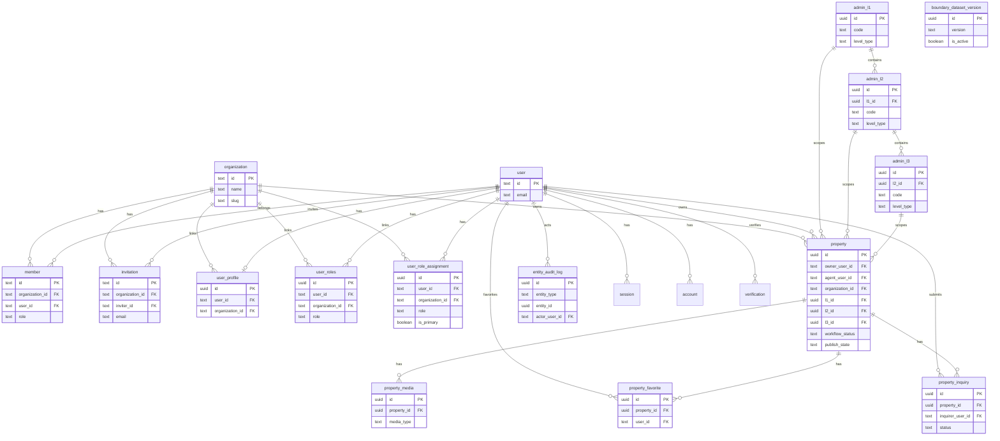

# Database Schema Reference (Canonical V2)

Last updated: February 16, 2026

This document describes the current canonical database schema after the core rewrite and legacy-table cleanup. It is based on:

- `src/infrastructure/db/schemas/auth-schema.ts`
- `src/infrastructure/db/schemas/enums.ts`
- `src/infrastructure/db/schemas/core-enums.ts`
- `src/infrastructure/db/schemas/users.ts`
- `src/infrastructure/db/schemas/admin-core.ts`
- `src/infrastructure/db/schemas/property-core.ts`
- `src/infrastructure/db/schemas/audit-core.ts`
- `src/infrastructure/db/migrations/0002_marketplace_core_rewrite.sql`
- `src/infrastructure/db/migrations/0003_drop_legacy_schema.sql`

## Scope and Design Principles

- Canonical org model is Better Auth tables: `organization`, `member`, `invitation`.
- Business tables use UUID PKs where applicable.
- Property domain is normalized into `property`, `property_media`, `property_favorite`, `property_inquiry`.
- Administrative hierarchy uses three levels: `admin_l1`, `admin_l2`, `admin_l3`.
- Geospatial support uses PostGIS types and spatial indexes.
- Soft delete is supported on core business entities through `deleted_at`.
- Audit is captured via `entity_audit_log`.

## Enum Catalog

## Existing enums (`src/infrastructure/db/schemas/enums.ts`)

- `UserRole`: `buyer | seller | agent | agency_admin | admin`
- `PropertyType`: `house | apartment | land | commercial`
- `PropertyStatus`: `draft | active | sold | rented | expired | suspended`
- `ListingType`: `sale | rent`
- `InquiryStatus`: `new | contacted | scheduled | closed`

## Core rewrite enums (`src/infrastructure/db/schemas/core-enums.ts`)

- `admin_l1_type`: `province | capital_city`
- `admin_l2_type`: `district | soum`
- `admin_l3_type`: `khoroo | bag`
- `property_workflow_status`: `draft | published | closed | archived`
- `property_publish_state`: `private | public`
- `property_location_source`: `pin | manual`
- `property_location_precision`: `point | l2 | l3`
- `property_media_type`: `image | video | document`
- `role_assignment`: `buyer | seller | agent | agency_admin | admin`

Note: `role_assignment` exists as enum; current role tables still use `UserRole`.

## Table Reference

## Authentication and Organization (Better Auth)

### `user`

- PK: `id` (text)
- Key fields: `name`, `email` (unique), `phone_number`, ban flags, timestamps
- Used as principal identity across all business entities

### `session`

- PK: `id` (text)
- FK: `user_id -> user.id (cascade)`
- Token/session metadata: `token` unique, expiry, client metadata

### `account`

- PK: `id` (text)
- FK: `user_id -> user.id (cascade)`
- OAuth/password credential and token fields

### `verification`

- PK: `id` (text)
- Verification token records by `identifier`, `value`, and expiry

### `organization`

- PK: `id` (text)
- Unique: `slug`
- Shared org object for teams/agencies

### `member`

- PK: `id` (text)
- FK: `organization_id -> organization.id (cascade)`
- FK: `user_id -> user.id (cascade)`
- Membership role and created timestamp

### `invitation`

- PK: `id` (text)
- FK: `organization_id -> organization.id (cascade)`
- FK: `inviter_id -> user.id (cascade)`
- Invitation email, role, status, expiry

## User Domain

### `user_profile`

- PK: `id` (uuid)
- FK: `user_id -> user.id (cascade)`
- FK: `organization_id -> organization.id (set null)`
- Fields: name parts, verification flags, avatar/bio, `metadata` jsonb
- Lifecycle: `created_at`, `updated_at`, `deleted_at`

### `user_role`

- PK: `user_id` (text, also FK to `user.id`)
- Quick primary role lookup via `primary_role` (`UserRole`)

### `user_roles`

- PK: `id` (uuid)
- FK: `user_id -> user.id (cascade)`
- FK: `organization_id -> organization.id (set null)`
- Flexible multi-role mapping with created timestamp

### `user_role_assignment`

- PK: `id` (uuid)
- FK: `user_id -> user.id (cascade)`
- FK: `organization_id -> organization.id (set null)`
- Fields: `role`, `is_primary`, `created_at`, `deleted_at`
- Canonical role assignment table introduced by rewrite

## Administrative Hierarchy and Geospatial

PostGIS extension is enabled in migration `0002_marketplace_core_rewrite.sql`.

### `admin_l1`

- PK: `id` (uuid)
- Unique: `code`
- Enum: `level_type` (`province | capital_city`)
- Geospatial:
- `geom geometry(MultiPolygon,4326)`
- `geom_simplified geometry(MultiPolygon,4326)`
- `bbox geometry(Polygon,4326)`
- Lifecycle: `created_at`, `updated_at`, `deleted_at`
- Indexes:
- btree: `admin_l1_level_type_idx`
- GIST: `admin_l1_geom_gix`, `admin_l1_geom_simplified_gix` (migration)

### `admin_l2`

- PK: `id` (uuid)
- FK: `l1_id -> admin_l1.id (cascade)`
- Unique: `(l1_id, code)`
- Enum: `level_type` (`district | soum`)
- Geospatial fields mirror `admin_l1`
- Lifecycle: `created_at`, `updated_at`, `deleted_at`
- Indexes:
- btree: `admin_l2_l1_id_idx`, `admin_l2_level_type_idx`
- GIST: `admin_l2_geom_gix`, `admin_l2_geom_simplified_gix` (migration)

### `admin_l3`

- PK: `id` (uuid)
- FK: `l2_id -> admin_l2.id (cascade)`
- Unique: `(l2_id, code)`
- Enum: `level_type` (`khoroo | bag`)
- Geospatial fields mirror `admin_l1`
- Lifecycle: `created_at`, `updated_at`, `deleted_at`
- Indexes:
- btree: `admin_l3_l2_id_idx`, `admin_l3_level_type_idx`
- GIST: `admin_l3_geom_gix`, `admin_l3_geom_simplified_gix` (migration)

### `boundary_dataset_version`

- PK: `id` (uuid)
- Unique: `version`
- Fields: `checksum`, `source_meta_json`, `imported_at`, `is_active`
- Indexes: `boundary_dataset_version_imported_at_idx`
- Purpose: version tracking and active dataset flag for boundary imports

## Property Domain

### `property`

- PK: `id` (uuid)
- FK: `owner_user_id -> user.id (restrict)`
- FK: `organization_id -> organization.id (set null)`
- FK: `agent_user_id -> user.id (set null)`
- FK: `l1_id -> admin_l1.id (set null)`
- FK: `l2_id -> admin_l2.id (set null)`
- FK: `l3_id -> admin_l3.id (set null)`
- Core fields:
- `title`, `description`
- `property_type` (`PropertyType`)
- `listing_type` (`ListingType`)
- `workflow_status` (`property_workflow_status`)
- `publish_state` (`property_publish_state`)
- Financial fields:
- `price_minor` (bigint, minor units)
- `currency_code` (default `MNT`)
- Physical attributes:
- `area_m2`, `bedrooms`, `bathrooms`, `floors`, `year_built`
- Location fields:
- `location_source` (`pin | manual`)
- `location_precision` (`point | l2 | l3`)
- `location_point geography(Point,4326)`
- `address_text`
- Metadata and counters:
- `features_json` jsonb
- `view_count`, `favorite_count`
- Lifecycle:
- `created_at`, `updated_at`, `published_at`, `closed_at`, `deleted_at`
- Indexes:
- btree: `l1_id`, `l2_id`, `l3_id`, `workflow_status`, `listing_type`, `price_minor`
- composite: `(l2_id, workflow_status, listing_type)`, `(l3_id, workflow_status, listing_type)`
- GIST: `property_location_point_gix` (migration)

### `property_media`

- PK: `id` (uuid)
- FK: `property_id -> property.id (cascade)`
- Fields: `url`, `media_type`, `sort_order`, `metadata_json`, `created_at`, `deleted_at`
- Indexes: by `property_id` and `sort_order`

### `property_favorite`

- PK: `id` (uuid)
- FK: `property_id -> property.id (cascade)`
- FK: `user_id -> user.id (cascade)`
- Fields: `created_at`, `deleted_at`
- Indexes: by `property_id` and `user_id`

### `property_inquiry`

- PK: `id` (uuid)
- FK: `property_id -> property.id (cascade)`
- FK: `inquirer_user_id -> user.id (cascade)`
- Fields: `message`, `contact_email`, `status` (`InquiryStatus`), `created_at`, `deleted_at`
- Indexes: by `property_id`, `inquirer_user_id`, `status`

## Audit and Operations

### `entity_audit_log`

- PK: `id` (uuid)
- FK: `actor_user_id -> user.id (set null)`
- Fields:
- `entity_type`, `entity_id`, `action`
- `before_json`, `after_json`
- `request_id`, `created_at`
- Indexes:
- `(entity_type, entity_id)`
- `actor_user_id`
- `created_at`

## Relationship Summary

- `organization` is the single canonical org parent table.
- `user_profile`, `user_roles`, `user_role_assignment`, and `property` can all reference `organization`.
- `property` references hierarchical geounits (`admin_l1`, `admin_l2`, `admin_l3`) and user actors (`owner`, `agent`).
- `property_media`, `property_favorite`, and `property_inquiry` are dependent child tables of `property`.
- `entity_audit_log` is append-only and references acting user optionally.

## Geospatial Behavior Notes

- Admin boundaries are modeled as multipolygons in SRID 4326.
- Both canonical and simplified geometries are stored for accurate containment and efficient rendering.
- BBox geometry is stored per unit for fast coarse filtering and tile workflows.
- Property point is stored as `geography(Point,4326)` to support spatial filters with GIST index.

## Legacy Cleanup Status

Migration `0003_drop_legacy_schema.sql` removed the previous legacy tables:

- `agency`, `agency_member`, `agency_invitation`
- `aimags`, `districts`, `subdistricts`
- `properties`, `property_favorites`, `property_inquiries`

Compatibility views created during parallel migration were also dropped:

- `agency_compat_v`
- `agency_member_compat_v`
- `agency_invitation_compat_v`

## Backfill and Operational Scripts

- Backfill script exists: `src/scripts/backfill-core-schema.ts`
- NPM command: `npm run db:backfill:core`

Important: after legacy table drop, this backfill script is no longer runnable without legacy sources.

## Recommended Next Documentation Additions

- Entity-level state transition matrix for `property_workflow_status` and `publish_state`
- API contracts for create/search/import endpoints
- Data retention policy for soft-deleted records and audit logs
- Boundary import SOP with validation checklist and rollback steps

## ERD Diagram (Mermaid)

